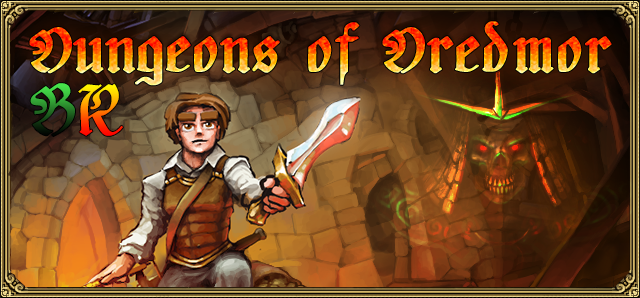

# Dungeons of Dredmor - Tradução para Português Brasileiro (pt-BR)

<div align="center">
   
</div>

## Introdução

Este é o projeto de tradução do **Dungeons of Dredmor** para **Português Brasileiro**, adaptado conforme o Acordo Ortográfico de 2010. O objetivo desse projeto é entregar uma tradução fiel, respeitando as piadas e o humor original do jogo, mas ajustado ao nosso contexto linguístico.

Este é um projeto independente, e a comunidade está sempre crescendo! Se você deseja contribuir, sua ajuda será muito bem-vinda.

Para dúvidas, sugestões ou feedback, sinta-se à vontade para me contatar através do meu perfil.

## Instruções de Instalação

Siga os passos abaixo para instalar o pacote de tradução:

1. Baixe a versão mais recente da tradução na seção de [releases](https://github.com/Starciad/DungeonsOfDredmor_PT-BR/releases).
2. Localize o diretório raiz do jogo, onde estão os arquivos principais. Se você usa Steam, o caminho padrão é:

   ```txt
   C:\Program Files (x86)\Steam\steamapps\common\Dungeons of Dredmor\
   ```

3. Extraia o conteúdo do arquivo `.zip` baixado diretamente no diretório raiz do jogo, substituindo os arquivos quando solicitado.
4. Abra o jogo e verifique se a tradução foi aplicada corretamente.

> [!IMPORTANT]
> Esse processo substituirá os arquivos originais do jogo. Recomendamos fazer um backup antes de proceder. Caso queira reverter a tradução, será necessário reinstalar o jogo.

## Contribuições

Contribuições são muito bem-vindas! Se você gostaria de colaborar com o projeto, siga estas orientações:

- Faça um fork do repositório.
- Crie um branch para suas alterações.
- Envie um pull request descrevendo as mudanças realizadas.
- Todo tipo de ajuda é bem-vindo, seja em correção de textos, sugestões de melhorias ou na adaptação cultural dos conteúdos.

Caso seu Pull Request esteja em conformidade, será realizada uma breve analise e por fim ele irá ser mesclado ao projeto.

## Licença

Este projeto está licenciado sob a Licença MIT. Para mais detalhes, consulte o arquivo [LICENSE](./LICENSE.TXT).

---

Agradecemos por seu interesse no projeto e esperamos que você aproveite **Dungeons of Dredmor** em Português Brasileiro!
